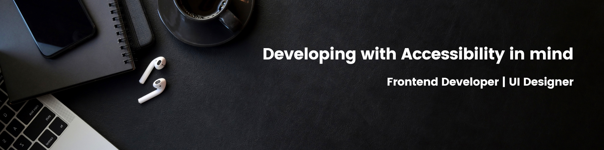

## <h2 align="center">Hi there 👋, I'm Udoka Ineh</h2>

#### Innovative and mental flexible Front-end Developer

- 😊 Pronouns: She/Her
- 💡 Fun fact: I'm currently participating in HNG internship.
- 🌱 I’m currently learning Framer motion and enhancing my skills in React.js.
- 🤔 I’m looking for help with open source projects, hackathons, internships, and entry-level opportunities.
- 💼 Job interests: Software Engineer, Frontend Engineer (Internship or Junior roles).

---

Here is a link to my **[Portfolio](https://udoka-inehs-portfolio.netlify.app/)**
Let's connect! Feel free to reach out to me through my **[Twitter](https://twitter.com/mag_daleneeee)** or **[LinkedIn](https://www.linkedin.com/in/udoka-ineh/).**

  🔥 Happy Coding! 🔥

